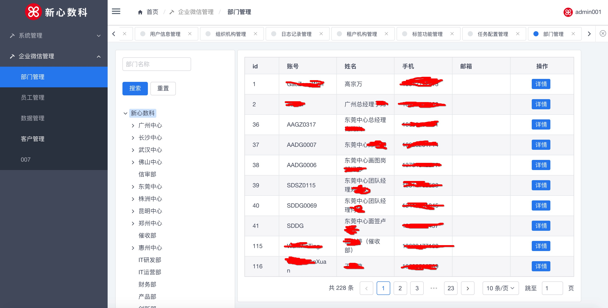

# XWSASS(Xinxin And Weixin Enterprise Edition Customer Information SASS)

  新心以及企业微信客户关系存留SASS系统。主要设计来保留企业员工与微信企业客户之间的业务交流信息。方便使用企业微信的公司，企业，组织留存企业微信客户，发现必要的业务可能性等。
  主要通过企业维系api，拉取到聊天信息，企业客户信息等。
  主要功能：
  1. 全面的权限管理，基于角色，人，组织关系的权限管理功能。
  2. 操作日志记录功能。
  3. 企业租户，组织架构管理等基本的租户管理功能。
  4. 定时调度任务配置管理等。主要用于同步企业微信信息到本地系统
  5. 企业微信部门，员工，客户信息，各种聊天消息信息等功能.视频，图片等功能还在开发中

## 产品需求
   
   1. 基于本公司业务人员与客户沟通，联系，业务往来的过程中的需求，希望在各个方面都能更好的服务客户，维系企业客户之间的联系。
   2. 市面上也很少有这样的业务系统，希望可以能够给一些公司带来业务上的方便
   3. 基于技术需要，使用前后端分离的方式。
   4. 可直接接入dubbo即可实现SOA等分布式开发模式
   5. 采用jwt token的方式进行登陆验证等
    
## 配置文件说明

   1. local----默认对应开发环境
   2. dev-----周版本测试环境
   3. test-----项目测试环境
   4. pre------生产验证环境
   5. prod-----对应生产环境配置文件
    
## 工程项目概述
    
   1. 工程结构说明,该项目工程文档中包含: 
   
        1. ci目录：主要使用了gitlab一些CI功能配置脚本，如sonar代码扫描等。
        2. sass-admin目录: 主要为前端代码目录。前端代码使用VUE技术，模版使用iview模版
        3. sql目录: 必要的数据初始化sql脚本，包括新增表，数据初始化脚本等
        4. *.dll文件主要是企业微信API接口SDK。为windows下格式。linux下的稍后在部署安装文档里面介绍
        5. 主要的java工程源代码包含7个子模块。由于公司技术规范以及开发框架等适应需要。
            
            + xwas-api主要包含对外提供Dubbo API相关的接口内容；
            + xwas-auth模块主要包括登陆验证，鉴权等功能代码；
            + xwaz-biz主要为业务代码实现功能，其中也包括对Dubbo API服务层的具体实现。
            + xwas-common 主要包含一些基本工具类，枚举值，全局变量等。
            + xwas-repository 主要包括mybatis的数据库访问层对象，逻辑代码等
            + xwas-sal 主要为对外API调用层代码实现。
            + xwas-web 主要为前端web接口，各种controller以及数据封装等业务代码
   
   
   2. 工具技术说明。主要使用的技术:
   
        1. Spring基本组件，Shiro权限管理组件，Dubbo服务化组件，Mybatis持久化组件, Quartz定时调度组件,
        2. 前端代码使用VUE技术，模版使用iview模版
        3. MySQL, Redis
        4. 企业微信SDK
        5. Java 8

    
## 安装启动配置说明
   
   通常来讲，我们的部署方案尽量考虑到多机备份，使用负载均衡服务等.如果在公有云上部署，可以使用SLB等.可以参考下面的 
    
   1. 后端项目部署
      
      1. clone代码到本地,修改必要的配置，如mysql数据库配置, Redis配置, Zookeeper配置等.具体位置在xwas-web的resources目录下面
      
      2. 执行编译打包。可以用下面的命令(mvn clean install -U -Pprod -X -Dmaven.skip.test=true)绕过单元测试执行打包，也可以导入到编辑工具如IDEA等打包即可.
      3. xwas-web target目录下生成的war包拷贝到已经配置好的tomcat服务器对应的webapp目录下启动即可
      4. 如果有需要修改tomcat的配置，如context配置，路径等可以参考tomcat官网相关的说明.
      5. **特别说明: 在启动应用之前需要初始化相关的数据信息以及配置好企业微信的SDK**。
      6. 新心内部公共技术包(common-lib)稍后整理放出
      6. 前端部署参见下面的前端部署内容
      
   2. 前端项目部署
   
   3. 如有需要配置nginx相关的代理
   
   4. 微信API配置说明
   
        因为微信API调用使用native的方式，因此需要单独解压其API到具体的系统，服务器lib扩展包下面。
      
        1. Window环境的配置。将Doc目录下Weixin_sdk_win.7z解压。 将里面的5个.dll(见下图)文件放到windows的系统文件夹(system32)下面。
        Java加载扩展包的顺序为系统级lib--->jre的lib-->扩展lib.因此将.dll文件放到工程代码目录里面也可以直接运行程序. 
       
        2. Linux环境配置. 将Doc目录下解压 weixin_linux_sdk_20200401.zip, 将解压后的java_sdk目录下面的libWeWorkFinanceSdk_Java.so文件放到Linux的lib目录下面
        /usr/lib。Java环境回默认读取该目录下的扩展包。如下图
        
        3. 特别说明由于java系统在加载native级别的lib的时候是一次性加载完成的，随着虚拟机的关闭而销毁。在每次启动应用程序，如tomact/spring boot的时候需要手动kill未停止的java进程。
    
   5. 访问首页即可, 参见下面的截图.
   
   
   
    
## 数据初始化
    
## 操作界面说明

   1. [租户以及微信API相关的配置操作](./doc/TENANT_USAGE.MD)
   2. [资源角色权限用户等相关的操作](./doc/ROLE_USER_USAGE.MD)
   3. [企业微信相关的数据功能操作](./doc/WEIXIN_USAGE.MD)

## 二次开发说明

## 界面展示

   1. 权限资源管理
   2. 角色权限管理
   3. 用户管理
   4. 组织机构管理
   5. 用户操作日志记录审计
   6. 租户机构管理
   7. 标签功能
   8. 定时任务配置
   9. 企业微信部门信息查看
   11. 企业微信员工查看
   12. 企业微信客户信息查看
   13. 企业微信消息内容查看

## 开源协议

本代码遵循 [MIT License](https://opensource.org/licenses/mit-license.php?spm=a2c4e.10696291.0.0.48ef19a4SnBzka)

Copyright 2020 www.xinxindigits.com

Permission is hereby granted, free of charge, to any person obtaining a copy of this software and associated documentation files (the "Software"), to deal in the Software without restriction, including without limitation the rights to use, copy, modify, merge, publish, distribute, sublicense, and/or sell copies of the Software, and to permit persons to whom the Software is furnished to do so, subject to the following conditions:

The above copyright notice and this permission notice shall be included in all copies or substantial portions of the Software.

THE SOFTWARE IS PROVIDED "AS IS", WITHOUT WARRANTY OF ANY KIND, EXPRESS OR IMPLIED, INCLUDING BUT NOT LIMITED TO THE WARRANTIES OF MERCHANTABILITY, FITNESS FOR A PARTICULAR PURPOSE AND NONINFRINGEMENT. IN NO EVENT SHALL THE AUTHORS OR COPYRIGHT HOLDERS BE LIABLE FOR ANY CLAIM, DAMAGES OR OTHER LIABILITY, WHETHER IN AN ACTION OF CONTRACT, TORT OR OTHERWISE, ARISING FROM, OUT OF OR IN CONNECTION WITH THE SOFTWARE OR THE USE OR OTHER DEALINGS IN THE SOFTWARE.