# XWSASS(Xinxin And Weixin Enterprise Edition Customer Information SASS)

  新心以及企业微信客户关系存留SASS系统。主要设计来保留企业员工与微信企业客户之间的业务交流信息。方便使用企业微信的公司，企业，组织留存企业微信客户，发现必要的业务可能性等。
  主要通过企业维系api，拉取到聊天信息，企业客户信息等。
  主要功能：
  1. 全面的权限管理，基于角色，人，组织关系的权限管理功能。
  2. 操作日志记录功能。
  3. 企业租户，组织架构管理等基本的租户管理功能。
  4. 定时调度任务配置管理等。主要用于同步企业微信信息到本地系统
  5. 企业微信部门，员工，客户信息，各种聊天消息信息等功能.视频，图片等功能还在开发中

## 产品需求
   
   1. 基于本公司业务人员与客户沟通，联系，业务往来的过程中的需求，希望在各个方面都能更好的服务客户，维系企业客户之间的联系。
   2. 市面上也很少有这样的业务系统，希望可以能够给一些公司带来业务上的方便
   3. 基于技术需要，使用前后端分离的方式。
   4. 可直接接入dubbo即可实现SOA等分布式开发模式
   5. 采用jwt token的方式进行登陆验证等
    
## 配置文件说明

   1. local----默认对应开发环境
   2. dev-----周版本测试环境
   3. test-----项目测试环境
   4. pre------生产验证环境
   5. prod-----对应生产环境配置文件
    
## 工程项目概述
    
   1. 工程结构说明,该项目工程文档中包含: 
   
        1. ci目录：主要使用了gitlab一些CI功能配置脚本，如sonar代码扫描等。
        2. sass-admin目录: 主要为前端代码目录。前端代码使用VUE技术，模版使用iview模版
        3. sql目录: 必要的数据初始化sql脚本，包括新增表，数据初始化脚本等
        4. *.dll文件主要是企业微信API接口SDK。为windows下格式。linux下的稍后在部署安装文档里面介绍
        5. 主要的java工程源代码包含7个子模块。由于公司技术规范以及开发框架等适应需要。
            
            + xwas-api主要包含对外提供Dubbo API相关的接口内容；
            + xwas-auth模块主要包括登陆验证，鉴权等功能代码；
            + xwaz-biz主要为业务代码实现功能，其中也包括对Dubbo API服务层的具体实现。
            + xwas-common 主要包含一些基本工具类，枚举值，全局变量等。
            + xwas-repository 主要包括mybatis的数据库访问层对象，逻辑代码等
            + xwas-sal 主要为对外API调用层代码实现。
            + xwas-web 主要为前端web接口，各种controller以及数据封装等业务代码
            + xwas-webops 主要为运营端前端web接口，各种controller以及数据封装等业务代码
   
   
   2. 工具技术说明。主要使用的技术:
   
        1. Spring基本组件，Shiro权限管理组件，Dubbo服务化组件，Mybatis持久化组件, Quartz定时调度组件,
        2. 前端代码使用VUE技术，模版使用iview模版
        3. MySQL, Redis
        4. 企业微信SDK
        5. Java 8

    
## 安装启动配置说明
   
   通常来讲，我们的部署方案尽量考虑到多机备份，使用负载均衡服务等.如果在公有云上部署，可以使用SLB等.可以参考下面的 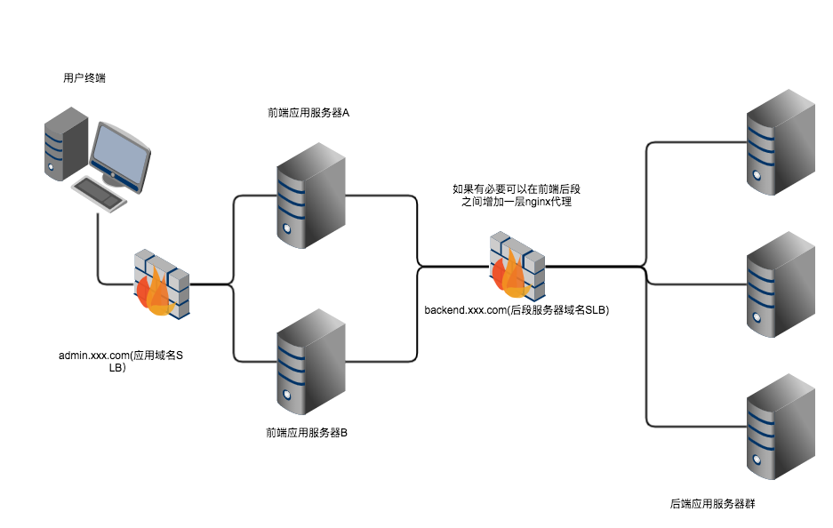
    
   1. 后端项目部署
      
      1. clone代码到本地,修改必要的配置，如mysql数据库配置, Redis配置, Zookeeper配置等.具体位置在xwas-web的resources目录下面
      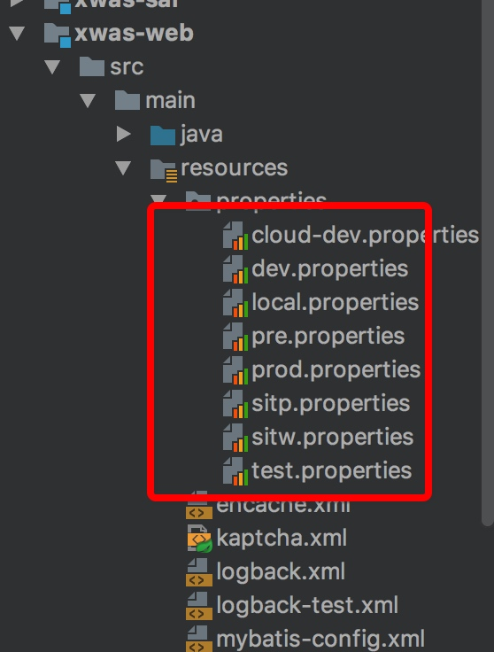
      2. 新心内部公共技术包(common-lib)放在doc目录下(xinxin-com-lib.zip)。如果在本地执行编译，或者二次开发的时候，需要将该公共包解压放到自己的maven类库里面。如下图路径等
         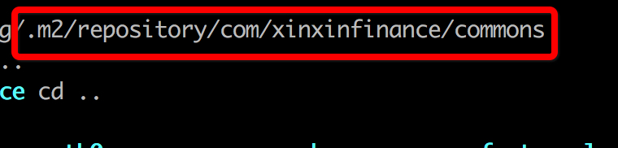
      3. 执行编译打包。可以用下面的命令(mvn clean install -U -Pprod -X -Dmaven.skip.test=true)绕过单元测试执行打包，也可以导入到编辑工具如IDEA等打包即可.
      4. xwas-web target目录下生成的war包拷贝到已经配置好的tomcat服务器对应的webapp目录下启动即可
      5. 如果有需要修改tomcat的配置，如context配置，路径等可以参考tomcat官网相关的说明.
      6. **特别说明: 在启动应用之前需要初始化相关的数据信息以及配置好企业微信的SDK**。
      7. 如果使用tomcat。可以配置一下具体的工程路径，让访问路径不加apname. 如下图:
         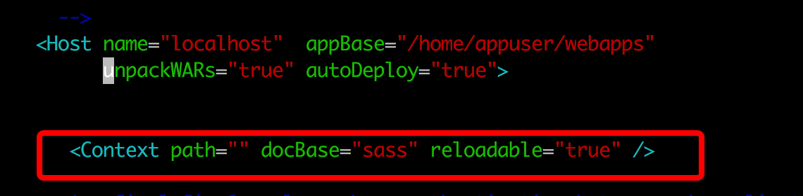
      8. 前端部署参见下面的前端部署内容
      9. **特别说明:在部署应用之前请执行数据初始化任务，详情参见数据初始化部分**
      
   2. 前端项目部署参见后段部署
   
   3. 如有需要配置nginx相关的代理
   
   4. 微信API配置说明
   
        因为微信API调用使用native的方式，因此需要单独解压其API到具体的系统，服务器lib扩展包下面。
      
        1. Window环境的配置。将Doc目录下Weixin_sdk_win.7z解压。 将里面的5个.dll(见下图)文件放到windows的系统文件夹(system32)下面。
        Java加载扩展包的顺序为系统级lib--->jre的lib-->扩展lib.因此将.dll文件放到工程代码目录里面也可以直接运行程序.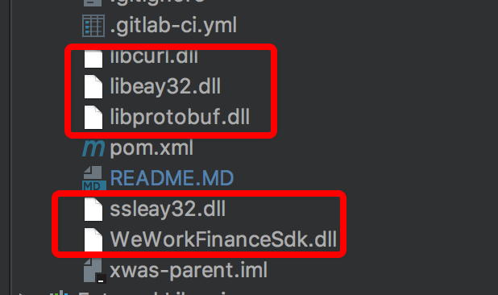 
       
        2. Linux环境配置. 将Doc目录下解压 weixin_linux_sdk_20200401.zip, 将解压后的java_sdk目录下面的libWeWorkFinanceSdk_Java.so文件放到Linux的lib目录下面
        /usr/lib。Java环境回默认读取该目录下的扩展包。如下图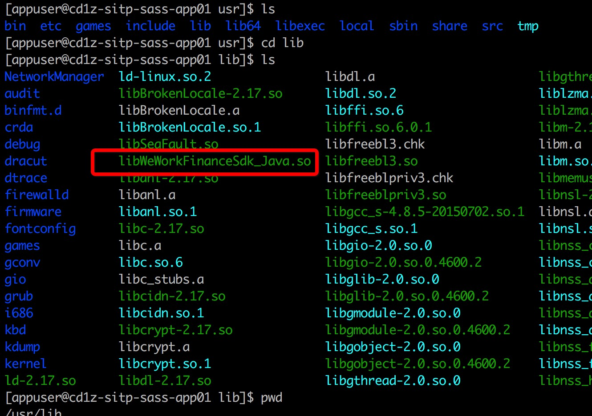
        
        3. 特别说明由于java系统在加载native级别的lib的时候是一次性加载完成的，随着虚拟机的关闭而销毁。在每次启动应用程序，如tomact/spring boot的时候需要手动kill未停止的java进程。
    
   5. 访问首页即可, 参见下面的截图.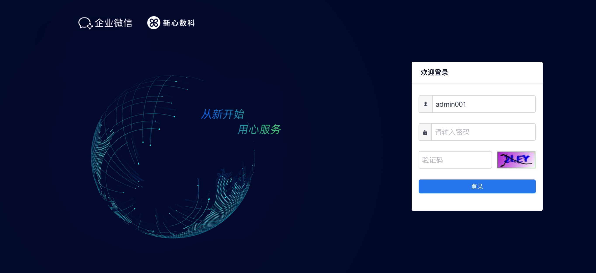
   
   6. 运营端部署。同样在打包之后在webops目录下面。找到对应的包(opss.war)。放入到tomcat的目录下.
   
   7. 运营后台的前端项目部署. sass-admin-ops(运营后台前端代码)与sass-admin部署方式一样。
   
   
   
    
## 数据初始化
  
   1. 设置好数据库之后，请执行数据新建表的sql,具体脚本在/sql/xwsass_init_database_DDL.sql。
   2. 执行第一步之后请执行数据初始化脚本sql,具体在/sql/xwsass_init_database_DML.sql。
   3. 初始化后的数据登陆管理员账号即可: admin001/admin001, 另外一个租户: alibabauser01/alibabauser01。
   4. 运营后台的角色默认包含三类:sass_admin,admin,sass_mng。初始化的数据sassadmin管理账号:sassadmin/sassadmin
   5. **特别说明：由于quartz的自带特性，数据初始化后，需要调整mysql的配置，让其忽略大小写敏感**
   
   ``
      1. 用ROOT登录，修改/etc/my.cnf
   　　2. 在[mysqld]下加入一行：lower_case_table_names=1
   　　3. 重新启动数据库即可
   ``
  
    
## 操作界面说明

   1. [租户以及微信API相关的配置操作](./doc/TENANT_USAGE.MD)
   2. [资源角色权限用户等相关的操作](./doc/ROLE_USER_USAGE.MD)
   3. [企业微信相关的数据功能操作](./doc/WEIXIN_USAGE.MD)

## 二次开发说明

   1. 开发技术规范说明:
      
      - 开发代码遵循Java开发的规范
      - 数据库使用MySQL, Mybatis生产的mapper文件以及XML文件分为mapper以及ext目录下面的扩展mapper，ext目录主要为开发人员自己编写的相关sql
      - SOA调用使用Dubbo。并且已经将Dubbo的接口调用做了相应的封装，返回结构包含SingleResult等内容，具体参见API下面的内容实现等
      - 日志等统一配置在logback.xml文件下面。可以根据具体的需要做相应的调整。
      - 另外针对业务异常错误的封装: 在异常情况下统一抛出BusinessException。并且设置对应的错误编码即可。aop拦截器回自动拦截这个异常，作出相应的处理。
      - 获取到登陆用户，只需要在继承AclController，调用getSassUserInfo方法即可。可以参见具体已经实现的rest接口里面的方法
      - JWT Token中已经带了用户的账号以及租户信息，可以直接在token解码之后拿到。同时前后端在http head里面统一使用"XToken"作为token字段
      
   2. 权限菜单功能开发说明:
      
      - 如果要新增权限资源菜单等功能。需要在全局权限表(auths)注册对应的权限值，在运营端后台添加注册即可.才可以在资源权限管理的菜单下面找到对应的权限
      - 如果要设置某个接口要求某个权限，可以使用RequiresPermissions注解即可。如果不需要权限验证，忽略即可
      - 返回结果的封装。针对与rest接口已经做了数据格式的封装，因此无需特别处理。具体格式如下:
      
      ``
       {
              "code":"SUCCESS",
              "message":"成功",
              "data":{}
       }
      ``
      
   3. Rest接口开发说明:
   
      1. Rest接口通常统一返回Object对象。AOP返回结构拦截器自动封装为必要的格式。接收POST请求里面的参数基本都Form表单对象的方式接收。
      2. 基本路径设置等遵循Rest命名规则。

## 界面展示

   1. 权限资源管理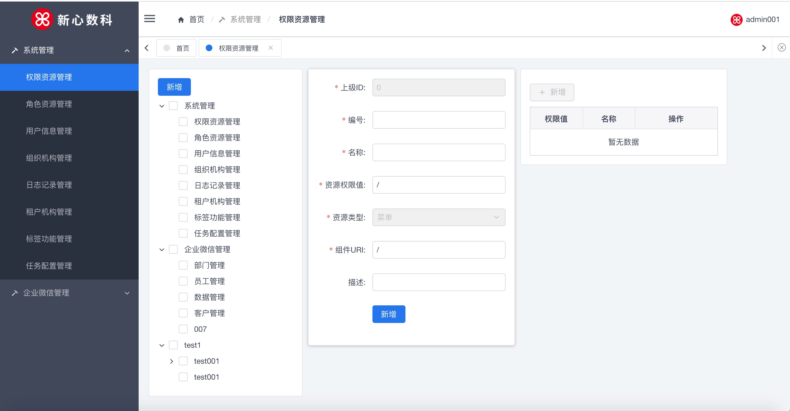
   2. 角色权限管理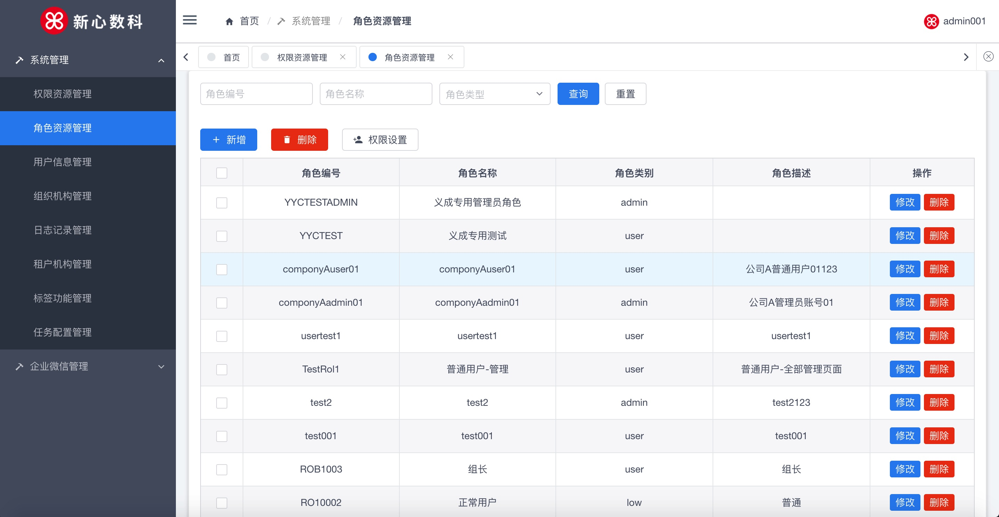
   3. 用户管理
   4. 组织机构管理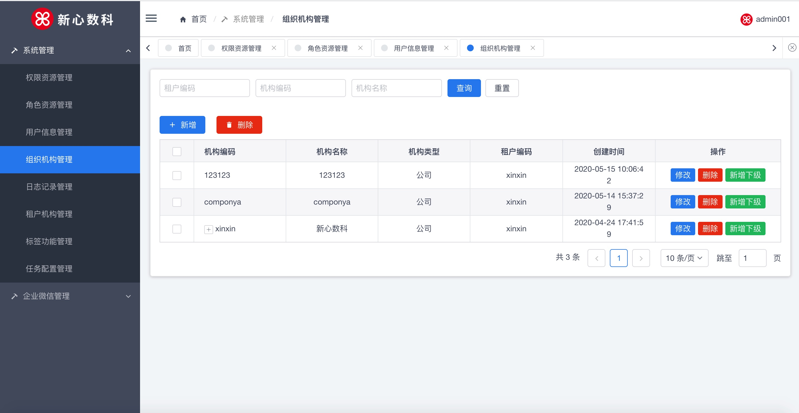
   5. 用户操作日志记录审计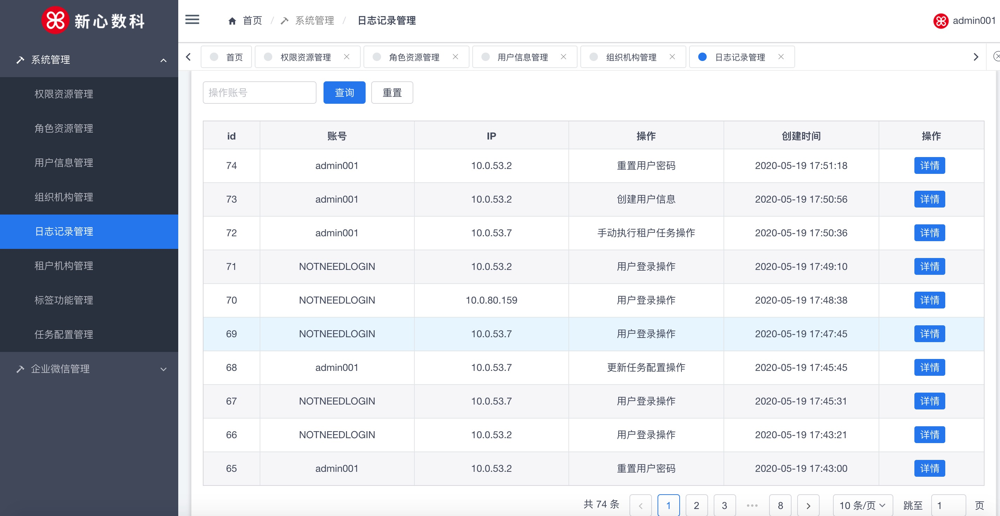
   6. 租户机构管理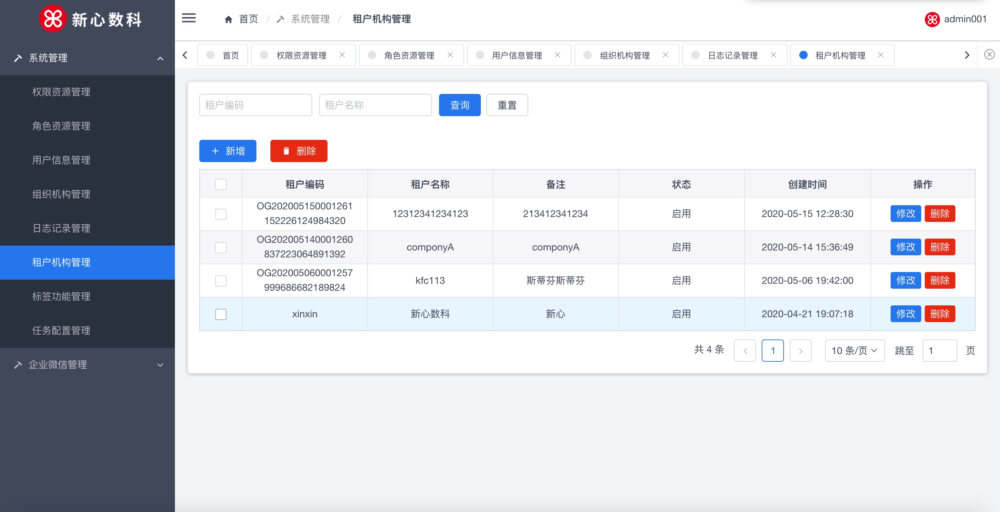
   7. 标签功能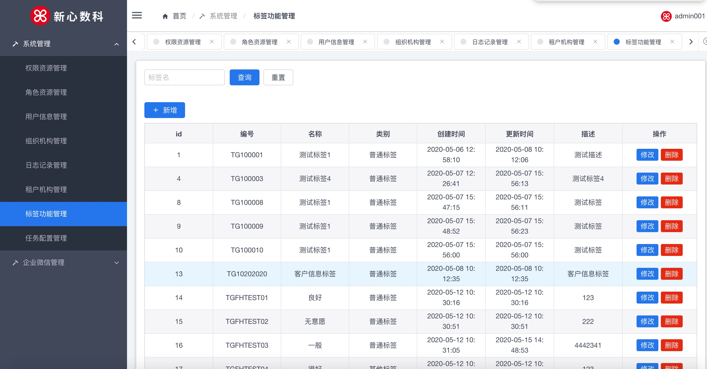
   8. 定时任务配置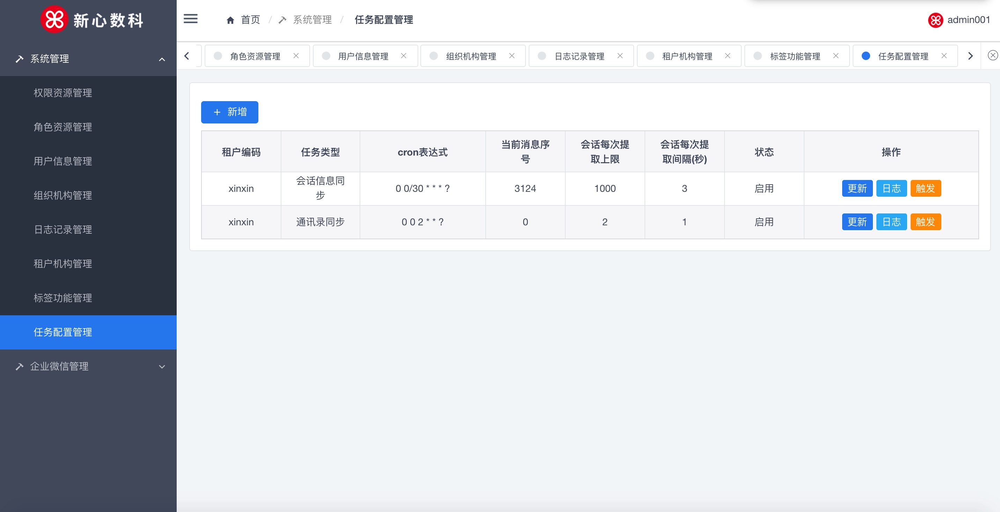
   9. 企业微信部门信息查看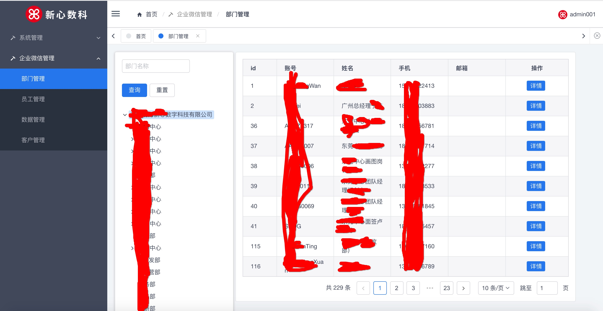
   11. 企业微信员工查看
   12. 企业微信客户信息查看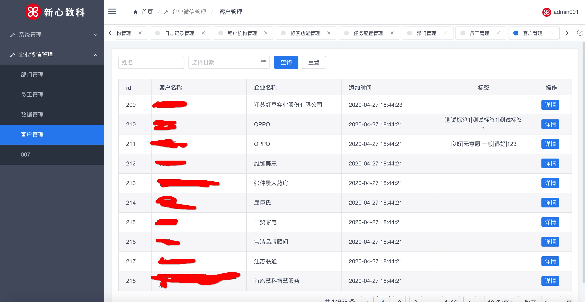
   13. 企业微信消息内容查看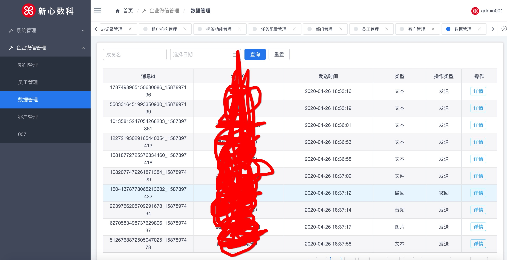
   14. 运营端租户管理界面: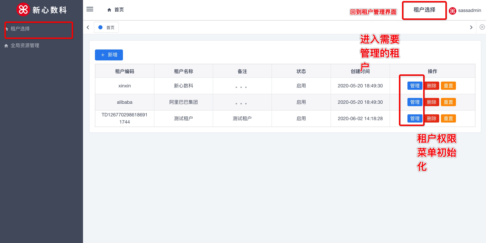
   15. 运营端后台全局权限管理: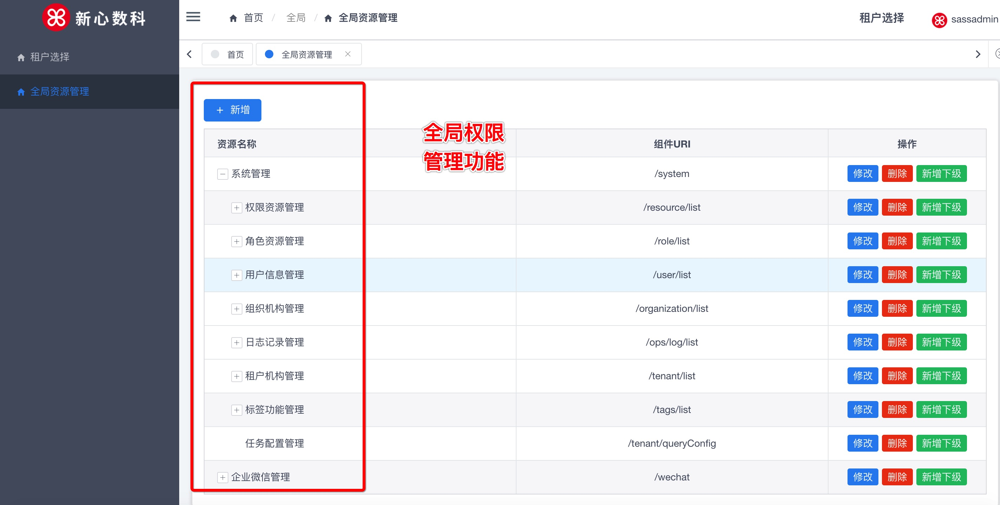

## 开源协议

本代码遵循 [MIT License](https://opensource.org/licenses/mit-license.php?spm=a2c4e.10696291.0.0.48ef19a4SnBzka)

Copyright 2020 www.xinxindigits.com

Permission is hereby granted, free of charge, to any person obtaining a copy of this software and associated documentation files (the "Software"), to deal in the Software without restriction, including without limitation the rights to use, copy, modify, merge, publish, distribute, sublicense, and/or sell copies of the Software, and to permit persons to whom the Software is furnished to do so, subject to the following conditions:

The above copyright notice and this permission notice shall be included in all copies or substantial portions of the Software.

THE SOFTWARE IS PROVIDED "AS IS", WITHOUT WARRANTY OF ANY KIND, EXPRESS OR IMPLIED, INCLUDING BUT NOT LIMITED TO THE WARRANTIES OF MERCHANTABILITY, FITNESS FOR A PARTICULAR PURPOSE AND NONINFRINGEMENT. IN NO EVENT SHALL THE AUTHORS OR COPYRIGHT HOLDERS BE LIABLE FOR ANY CLAIM, DAMAGES OR OTHER LIABILITY, WHETHER IN AN ACTION OF CONTRACT, TORT OR OTHERWISE, ARISING FROM, OUT OF OR IN CONNECTION WITH THE SOFTWARE OR THE USE OR OTHER DEALINGS IN THE SOFTWARE.

## 额外补充协议
Redistribution and selling copies of the software are prohibited, only if the authorization from xinxin digits was obtained.
Neither the name of the xinxin digits; nor the names of its contributors may be used to endorse or promote products derived from this software without specific prior written permission.

## 联系方式

如在安装，二次开发中遇到相关的问题，可以扫描下面的二维码询问:
