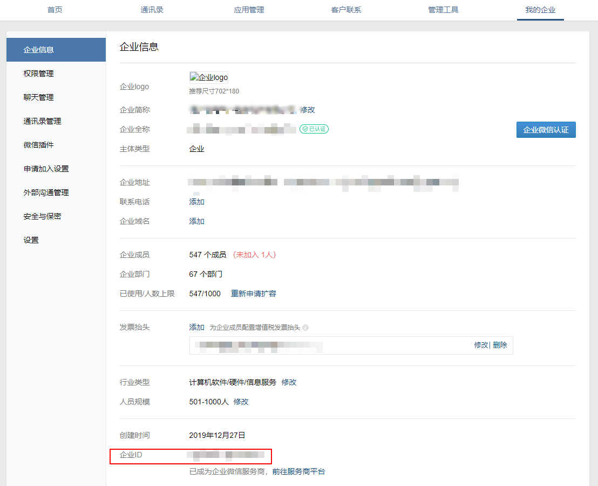
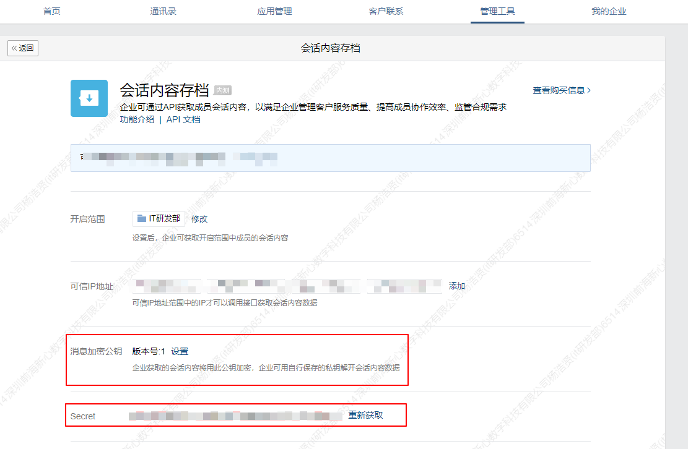
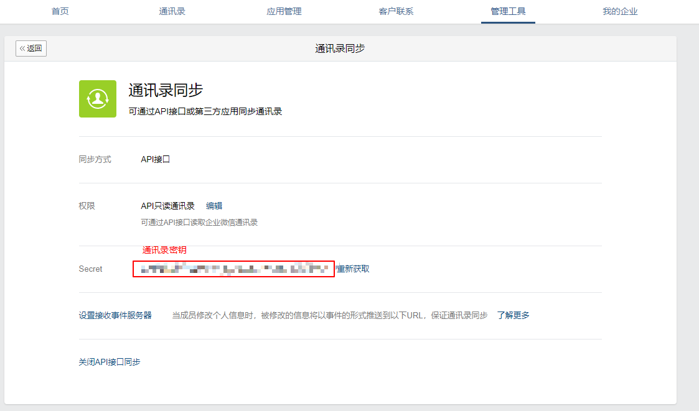
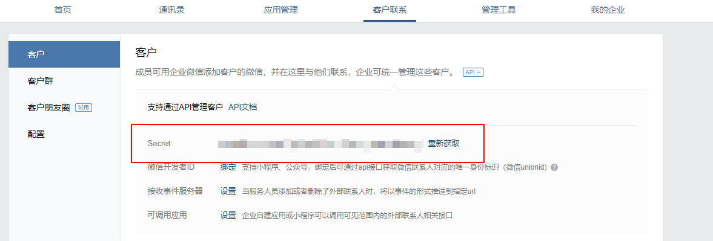
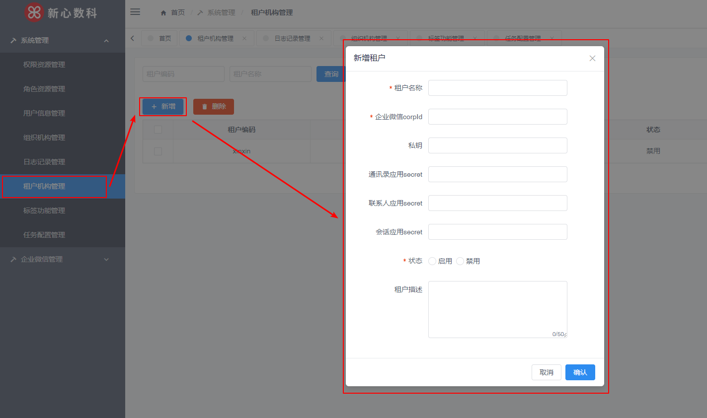
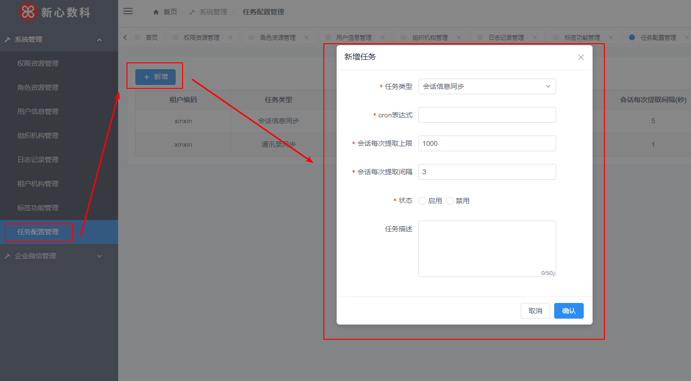

# 租户以及微信API相关的配置操作
    
## 企业微信配置
   1. 企业微信管理员登录[企业微信后台](https://work.weixin.qq.com/wework_admin/loginpage_wx?from=myhome)  
      1. 在我的企业菜单中的企业信息模块获取企业ID(cropid)，如下图
    
      2. 生成密钥对，将公钥配置在管理工具菜单中的会话内容存档模块中，并记录下私钥与会话应用Secret，如下图  
      
      3. 在管理工具菜单的通讯录同步模块中记录下通讯录Secret，如下图  
      
      4. 在客户联系菜单中获取外部联系人Secret，如下图  
      
   2. 在xwsass的租户机构管理模块中新增/修改租户配置，将上述密钥填入表单并提交，即可完成租户配置，如下图  

   3. 在xwsass的机构配置管理模块中设置创建任务，设置任务参数，即可为租户配置定时任务，如下图